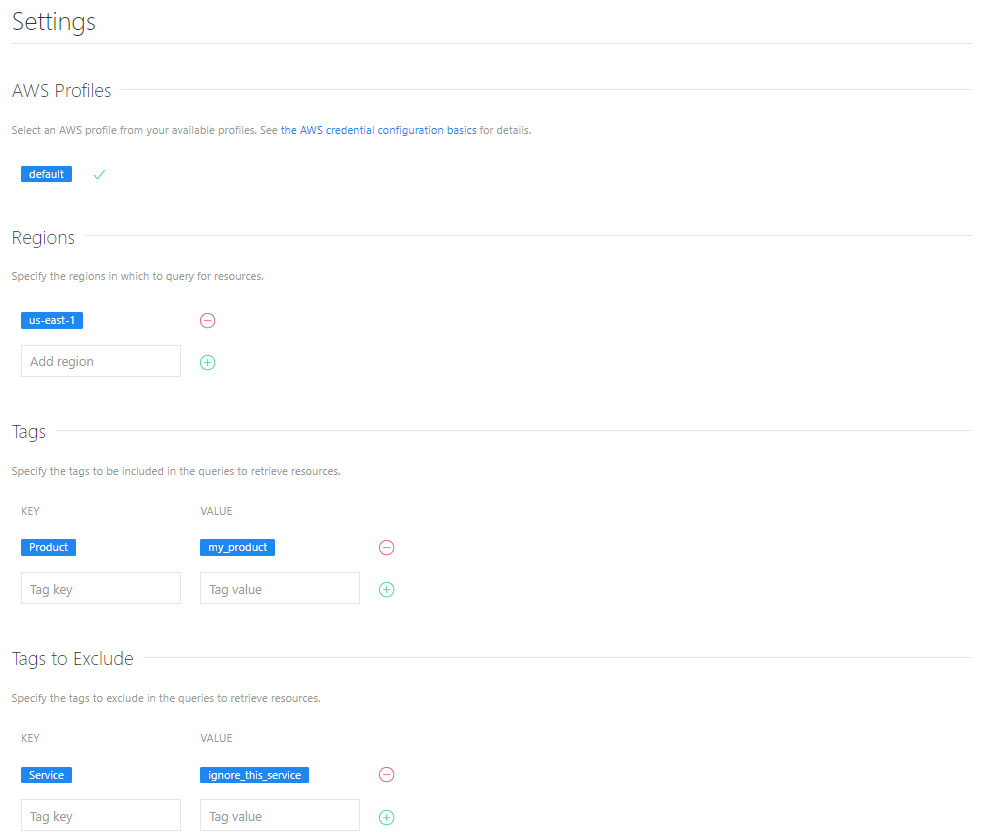

# cloud-browser
## Set-up
### Prerequisites
- [Git](https://git-scm.com/downloads) (of course!)
- [Python 3.9](https://www.python.org/downloads/release/python-395/) or greater
### Initial set up (Linux, Mac, & Windows)
1. Clone the repository
```sh
git clone https://github.com/brianwalborn/cloud-browser.git
```
2. `cd` into the `cloud-browser` directory
```sh
cd cloud-browser
```
### Running the application (in a bash console)
1. Install the dependecies with `pip`
```sh
pip install -r requirements.txt
```
2. Set the `FLASK_APP` environment variable
```sh
export FLASK_APP=cloud_browser
```
3. Initialize the database
```sh
flask init-database
```
4. Run the application
```sh
flask run
```
### Running the application (in PowerShell)
1. Install the dependecies with `pip`
```powershell
py -m pip install -r .\requirements.txt
```
2. Set the `FLASK_APP` environment variable
```powershell
$env:FLASK_APP="cloud_browser"
```
3. Initialize the database
```powershell
py -m flask init-database
```
4. Run the application
```powershell
py -m flask run
```
### Initialize settings
1. Enter the desired regions and tags on the settings page. For example:

